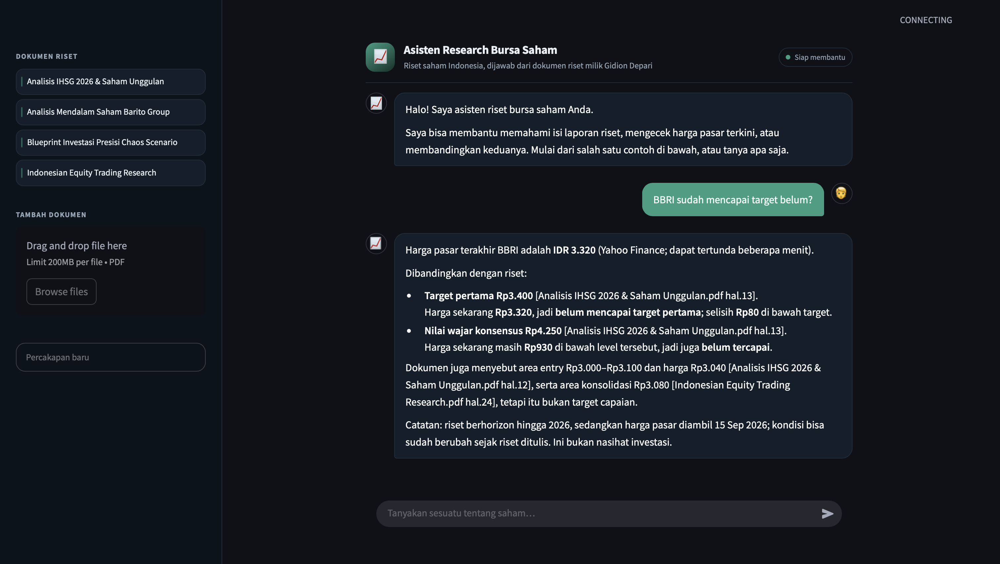

# Stock Research Assistant

**Name:** Gidion Depari  -
**LinkedIn:** [LinkedIn Profile](https://www.linkedin.com/in/gidion2)



**RAG chatbot for Indonesian stock research.** It answers questions using Gidion's personal collection of research documents, cites file names and page numbers, retrieves market prices only when a question actually requires them, and calculates profit/loss in Python rather than in the language model.

    

> ⚠️ The output of this system is a summary of research documents, **not investment advice**. Market prices come from Yahoo Finance and may be delayed by a few minutes.

---

## Table of Contents

- [Overview](#overview)
- [Quick Start](#quick-start)
- [What It Can Do](#what-it-can-do)
- [Architecture](#architecture)
- [Evaluation Results](#evaluation-results)
- [Project Structure](#project-structure)
- [Testing](#testing)
- [Configuration & Technology](#configuration--technology)
- [Data & Credential Handling](#data--credential-handling)
- [Limitations and Next Steps](#limitations-and-next-steps)
- [License](#license)

---

## Overview

The problem is simple: stock research documents keep piling up, and answering one question means opening PDFs one by one. Sending the same question to a general language model can produce an answer that sounds convincing but cannot be checked, and for decisions involving money, that is not enough. This system addresses that gap with three rules enforced by the code, not just by intention:

1. **Every claim from a document must have a citation** `[file name p.N]`, and the citation is verified against the actual document chunks sent to the model.
2. **Market prices come from a price source**, only when the question actually needs price data, not from the model's memory.
3. **Questions outside the supported scope are rejected**, not guessed.

### Scope

| Field | Description |
|---|---|
| **Users** | Retail investors or analysts who have their own research document collection |
| **Input** | Questions in Indonesian; research PDFs uploaded by the user |
| **Output** | Answers with citations, timestamped market prices, profit/loss calculations |
| **Out of scope** | Commodities, crypto, foreign indices, and anything not covered by the documents. The system rejects it instead of guessing. |

### Example Corpus

The built-in knowledge base contains **four Indonesian market research reports totaling 68 pages**. They were collected independently and are not licensed securities research publications. These documents are included so the evaluation numbers below can be reproduced as they are. To use your own documents, replace the contents of `data/knowledge_base/primary/` and run ingestion again.

---

## Quick Start

Requirements: **Python 3.10+**, **PostgreSQL with the `pgvector` extension**, and one LLM API key (DeepSeek by default, Groq as an alternative).

```bash
# 1. Install dependencies and add credentials
pip install -r requirements.txt
cp .env.example .env          # fill in DATABASE_URL and DEEPSEEK_API_KEY
# 2. Build the knowledge base from PDFs in data/knowledge_base/primary/
python -m scripts.create_database
python -m scripts.ingest_knowledge_base
python -m scripts.build_gold_chunks
# 3. Run the application
streamlit run app.py
```

On the first run, step 2 downloads the embedding model from Hugging Face. After that, it is always loaded from the local cache. There are no paid API calls during ingestion. LLM costs only appear when answering questions.

> `build_gold_chunks` **must** be run again whenever the knowledge base or chunking configuration changes. The reason is explained in the [Architecture](#architecture) section.

---

## What It Can Do

| Question | Intent | What happens |
|---|---|---|
| "What is BBRI's outlook according to the research?" | `RAG` | search documents → answer with citations |
| "What is BBRI's current price?" | `LIVE_PRICE` | resolve ticker → Yahoo Finance |
| "Has BBRI reached its target?" | `LIVE_COMPARE` | market price + target from research |
| "I bought BBRI at 4,000, how much profit do I have?" | `LIVE_COMPARE` | profit/loss is calculated in Python, LLM only explains it |
| "What is the price of gold today?" | `OUT_OF_SCOPE` | rejected before even reading a document |

The conversation keeps memory while the session is active. After discussing BBRI, a question such as "What about the target?" is still answered for BBRI. Only the **search query** is completed with the missing context. The question sent to the model remains the user's original question. New documents can be uploaded directly from the interface, and they use the exact same ingestion pipeline as the command line flow.

---

## Architecture

The system has two separate flows: one builds the database offline, and the other answers questions online whenever the user asks something.

### Flow A: From PDF to Database (Offline)

```text
        data/knowledge_base/primary/*.pdf          4 documents
                         │
                         ▼
        ┌──────────────────────────────────┐
        │            load_pdf()            │  PyPDFLoader
        │          preprocessing.py        │  one Document per page
        └─────────────────┬────────────────┘  68 pages
                          ▼
        ┌──────────────────────────────────┐  remove bibliography pages → 5
        │           page curation          │  cut at markers           → 4
        │           + clean_text()         │  remove citation markers  → 201
        └─────────────────┬────────────────┘  fix broken words
                          ▼                    63 pages kept
        ┌──────────────────────────────────┐
        │         split_documents()        │  RecursiveCharacterTextSplitter
        │                                  │  chunk 500 · overlap 80
        └─────────────────┬────────────────┘  308 chunks
                          ▼
        ┌──────────────────────────────────┐
        │         stable_chunk_id()        │  sha1(source|page|text)[:12]
        └─────────────────┬────────────────┘  content-addressed
                          ▼
        ┌──────────────────────────────────┐
        │       embed 384 dimensions       │  paraphrase-multilingual-
        │           embeddings.py          │  MiniLM-L12-v2
        └─────────────────┬────────────────┘
                          ▼
        ┌──────────────────────────────────┐
        │       PostgreSQL + PgVector      │  table `stock_knowledge`
        │           vector_store.py        │  vector + metadata:
        └──────────────────────────────────┘  source · page · chunk_id
```

Three decisions in this flow have a major impact on the quality of the whole system:

| Decision | Reason |
|---|---|
| Remove bibliography pages (5 pages) | Titles of cited articles are not the research content, but they are very similar in meaning and can pollute search results. |
| Remove citation markers (201 markers) | Footnote numbers that get flattened into the text ("…jenuh jual yang pekat. 21 BMRI menawarkan…") become false numbers inside the context, while the prompt requires numbers to be preserved as they are. |
| Content-addressed `chunk_id` | If the text or chunking configuration changes, the ID changes too. This makes stale gold annotations visible instead of silently lowering the score. This is why `build_gold_chunks` must be run again. |

### Flow B: From Question to Answer (Online)

```text
                               question
                                  │
                          ┌───────▼────────┐
                          │     ROUTER     │  patterns first, LLM only
                          │ (src/router.py)│  when the pattern is unclear
                          └───────┬────────┘
              ┌───────────────────┼─────────────────────┐
              │                   │                     │
        OUT_OF_SCOPE             RAG          LIVE_PRICE / LIVE_COMPARE
              │                   │                     │
            stop          ┌───────▼────────┐    ┌───────▼─────────┐
        (0 network)       │   retriever    │    │ ENTITY RESOLVER │
                          │   PgVector     │    │ 1. explicit     │ regex, deterministic
                          │     k=8        │    │ 2. session      │ "that stock" → BBRI
                          └───────┬────────┘    │ 3. semantic     │ PgVector + LLM
                                  │             └───────┬─────────┘
                          ┌───────▼────────┐            │
                          │    LLM +       │    ┌───────▼─────────┐
                          │    prompt      │    │ market_data     │ Yahoo Finance
                          │    grounding   │    │ profit_loss     │ calculated in Python
                          └───────┬────────┘    └───────┬─────────┘
                                  └──────────┬───────────┘
                                             ▼
                                     answer + citations
```

What makes this different from a standard RAG system is that the **router runs first**, so the decision to read documents, get a price, or reject the question is made before any document is read and before any network request is sent. Entity resolution also **does not use a ticker registry built at the start**. The ticker is resolved at query time, starting from the cheapest method and moving to the more expensive one only when needed.

### Rules Behind the Design

The following eight rules are enforced by tests, not merely by convention.

1. **Yahoo Finance is only called when the question needs a price.** RAG and out-of-scope questions make **zero** network requests. This is measured by a counter, not assumed.
2. **The entity resolver does not use Yahoo to validate a ticker.** In the previous version, every uppercase word could turn into one network request.
3. **An explicit ticker has a deterministic fast path**, with zero LLM calls and zero network requests.
4. **Ambiguous entities are not guessed**. The user is asked to clarify.
5. **An uncertain symbol is not sent to the market data source.** An unknown exchange returns `None`, not a bare ticker. `LYC` is not `LYC.AX`, and yfinance cannot tell the difference.
6. **Profit/loss is calculated in Python.** The LLM only explains the resulting numbers.
7. **Conversation memory stores identity only** (ticker, company, exchange). Price is never stored as a fact. It is always retrieved again.
8. **Every claim from a document must have a citation**, and the citation is verified against the document that was actually sent to the model.

---

## Evaluation Results

```bash
python -m scripts.evaluate                      # retrieval
python -m scripts.evaluate_answers              # answers, RAG only
python -m scripts.evaluate_answers --end-to-end  # answers, through router
python -m scripts.evaluate_router --llm --semantik
```

Dataset: **25 questions**, 20 in scope and 5 out of scope, across 4 documents (308 chunks). One file, `evaluation/dataset/eval_questions.json`, is the single source for all evaluators.

### Retrieval (chunk level, k=8)

Metrics are reported at the **chunk level**, not the source level. With four documents and k=8, source-level metrics are not very informative; they report 1.0000 in nearly every case.

| k | HitRate | Recall | Precision |
|---:|---:|---:|---:|
| 1 | 0.4000 | 0.1497 | 0.4000 |
| 3 | 0.6000 | 0.2931 | 0.2833 |
| 5 | 0.8500 | 0.4931 | 0.2500 |
| 8 | **0.9000** | 0.5472 | 0.1688 |

MRR **0.5371** · 74 gold chunks · average 3.7 per question · 19 strict, 1 relaxed Precision@8 is low by design: on average only 3.7 of the 8 chunks are gold, so the rest are counted as wrong even though k is intentionally loose. For this case, HitRate and MRR are more useful.

### End-to-End Answer Quality

Latest verified run:

```bash
python -m scripts.evaluate_answers --end-to-end
```

The evaluation contains **25 questions**: 20 in scope and 5 out of scope.

| Metric | End-to-end |
|---|---:|
| Answer Rate | **0.9000** |
| Citation Rate | **1.0000** |
| False Refusal Rate | **0.0000** |
| Out-of-Scope Refusal | **1.0000** |

The **0.9000 Answer Rate** corresponds to two in-scope cases that remain problematic: `ihsg_02` and `equity_03`. Citation Rate is 1.0000 for the answers that were produced, while the system made no false refusals and rejected all five out-of-scope questions.

The intent distribution observed in this same end-to-end run was:

| Intent | Count |
|---|---:|
| `RAG` | 21 |
| `OUT_OF_SCOPE` | 3 |
| `LIVE_PRICE` | 1 |

This means one out-of-scope question still entered the RAG path and one entered the LIVE_PRICE path, but the downstream safeguards rejected both. As a result, the final Out-of-Scope Refusal score remained **1.0000**.

### Runtime Cost and Network Activity (One End-to-End Run, 25 Questions)

| Resource | Result |
|---|---:|
| Embedding model source | local cache |
| Hugging Face requests | **1** |
| Yahoo Finance requests | **0** (cache hits: 0) |
| LLM calls | **35** (router 13 · resolver 1 · answers 21) |

The zero Yahoo Finance request count is expected for this run. Although the dataset contains an out-of-scope question asking for the current gold price, it does not contain a supported stock-price query that proceeds to Yahoo Finance. The gold-price question is rejected by the entity/scope safeguards before any Yahoo request is made. Research-only RAG questions also do not call Yahoo Finance.

> All numbers above come from the same revised dataset. `scripts/evaluate.py` stores the dataset fingerprint together with the results and **refuses to compare** two runs with different datasets. Changes to annotations must not look like system improvements.

### Two Known In-Scope Failures

The latest end-to-end evaluation flags two in-scope questions with incomplete keyword coverage at `k=8`:

- **`ihsg_02`**: expected keywords include `MSCI` and `rupiah`, but neither is covered by the retrieved evidence (`matched: []`). The relevant answer content falls across a chunk boundary, so the retriever reaches related context without retrieving the continuation that contains the required factors.
- **`equity_03`**: expected keywords include `stripping ratio` and `Rp172`, but neither is covered by the retrieved evidence (`matched: []`). The gold annotation is intentionally focused on the concrete BUMI risks rather than generic mentions of BUMI and risk.

These failures are consistent with the current retrieval baseline: chunk size 500, overlap 80, `paraphrase-multilingual-MiniLM-L12-v2`, similarity search, and `k=8`. Fixing them requires testing a revised retrieval or chunking strategy rather than changing the evaluation labels simply to increase the score.

---

## Project Structure

```text
src/
  router.py              intent classification (pattern → LLM when needed)
  entity_resolver.py     ticker: explicit → session → semantic
  market_symbols.py      exchange symbol conventions (IDX → .JK, ASX → .AX, …)
  market_data.py         the only point that touches yfinance
  profit_loss.py         position calculation, deterministic
  live_price.py          LIVE_PRICE path
  live_compare.py        LIVE_COMPARE path (price + research content)
  memory.py              conversation memory (identity + history)
  session_context.py     conversation identity; rejects price fields
  assistant.py           orchestrator: directs the flow, does not do the work
  rag_chain.py           retrieve → prompt → cited answer
  retriever.py           PgVector similarity, k=8
  vector_store.py        PostgreSQL + PgVector
  embeddings.py          embedding model (local cache first)
  preprocessing.py       load PDF, clean, split into chunks
  ingestion.py           add new documents to the knowledge base
  prompts.py             all prompts, in one place
  evaluation.py          chunk-level retrieval metrics
  answer_evaluation.py   answer quality metrics
  gold_chunks.py         gold chunk annotations
  utils.py               get JSON objects from LLM responses
  config.py              all configurable values
scripts/
  create_database.py          create vector tables (once at the beginning)
  ingest_knowledge_base.py    build the knowledge base
  build_gold_chunks.py        derive and audit gold annotations
  evaluate.py                 retrieval evaluation
  evaluate_answers.py         answer evaluation (RAG only / end-to-end)
  evaluate_router.py          router + entity resolver evaluation
  diagnose_retrieval.py       inspect retrieval failures by question
  diagnose_embeddings.py      track Hugging Face requests
  diagnose_market_data.py     track yfinance failures
evaluation/dataset/
  eval_questions.json    single source of questions for all evaluators
  gold_chunks.json       gold annotations (derived, can be manually corrected)
  router_eval.json       intent + entity dataset
app.py                   Streamlit interface
notebooks/               early experiments
tests/                   21 test files
```

---

## Testing

```bash
pytest -q
```

**324 passed, 28 skipped.** The skipped tests require PostgreSQL, an LLM API key, the embedding model, or direct network access. They are skipped automatically when their dependencies are not available, so `pytest` still provides useful results on different machines, including machines without a database. Beyond normal functional correctness, the tests protect things that can easily break silently:

- RAG and out-of-scope questions make zero Yahoo requests (counted, not assumed)
- `app.py` never shows the model name, PgVector configuration, API key, or router traces to the user
- conversation memory rejects price fields
- the evaluation dataset has only one source of questions
- the embedding model uses the local cache and does not download again

---

## Configuration & Technology

All configurable values are in `src/config.py`, and they are stored with each evaluation result through `config.describe()` so every number can be traced back to the configuration that produced it.

| Component | Choice | Reason |
|---|---|---|
| Vector store | PostgreSQL + PgVector | Stores vectors and metadata in one database, eliminating the need for a separate vector service. |
| Embedding | `paraphrase-multilingual-MiniLM-L12-v2` (384 dim) | Multilingual, handles Indonesian and English mixed in research documents, and is small enough to run on CPU. |
| Chunking | 500 characters, overlap 80 | Short enough to keep one chunk focused, while still long enough to keep numbers and context together. |
| Retriever | Similarity, k=8 | A loose k was chosen intentionally. HitRate is more important than Precision for this question answering task. |
| LLM | DeepSeek (default), Groq alternative | Selected through one `LLM_PROVIDER` variable and created in `get_llm()`, so changing providers does not affect the rest of the logic. |
| Market data | Yahoo Finance via `yfinance` 1.7.0 | Version ≥ 0.2.66 uses `curl_cffi`; older versions are rejected by Yahoo with `YFRateLimitError`. |
| Interface | Streamlit 1.44.1 | The interface contains no business logic; it only handles the UI and calls `jawab()`. |

---

## Data & Credential Handling

- Credentials are only read from `.env`, which is included in `.gitignore`. `.env.example` contains placeholders, not real values.
- The interface never shows the model name, API key, PgVector configuration, or router traces, and there is a test to protect this.
- User-uploaded documents are stored locally in `data/knowledge_base/additional/` and embedded into the local database. No files are sent to third parties except for the text chunks that are included in the LLM prompt.
- Document content is untrusted input. The prompt separates document context from instructions, and citations are verified against the documents actually sent to the model. However, the system has **not** been specifically tested against prompt injection through PDF content.

---

## Limitations and Next Steps

**Known limitations:**

- Market prices may be delayed by a few minutes and are not live exchange quotes. Every price answer includes a timestamp and disclaimer.
- Answers are limited to the knowledge base. Outside questions are rejected.
- Conversation memory lives during the session and is cleared when "New Conversation" is selected or the page is reloaded.
- Evaluation numbers apply to a 4-document / 308-chunk scale. The system has not yet been tested on a larger corpus. **The most important design decision:** the router runs before retrieval. This makes out-of-scope questions stop without cost and makes the claim of "zero Yahoo requests for research questions" measurable. **One limitation that is not finished yet:** `ihsg_02` fails because the chunk boundary separates the topic sentence from the list of answers. This is a chunking problem, not an embedding problem. **Next test:** compare paragraph-based chunking against the current 500/80 baseline, using the same dataset fingerprint so the two numbers can actually be compared.

---

## License

This project was created for learning and portfolio purposes. The research documents in `data/knowledge_base/` are included as an example corpus so the evaluation results can be reproduced, and they are not licensed research publications. No part of the system output is intended as investment advice.
